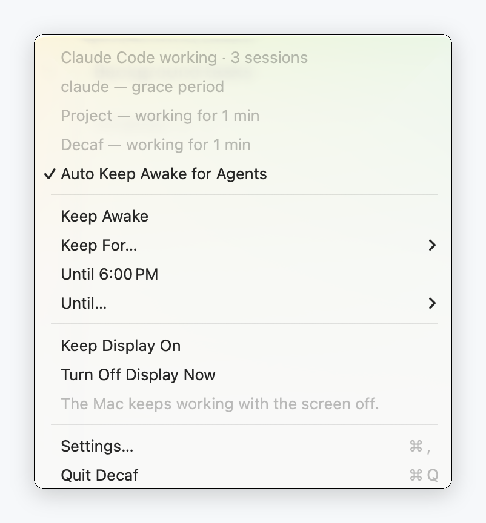

<div align="center">


# Decaf

**The `caffeinate` command as a smart menu bar app.**

Keeps your Mac awake while Claude Code is actually working — and lets it sleep the moment the agent is done, or is only waiting on you.

Every other keep-awake app is a switch you have to remember to turn off. This one puts itself down.

<picture>
  <source media="(prefers-color-scheme: dark)" srcset="docs/assets/menu-hero-dark.png">
  
</picture>

<p>
  <a href="https://github.com/AlanY1an/decaf/releases/latest"></a>
  
  <a href="https://github.com/AlanY1an/homebrew-decaf"></a>
  <a href="LICENSE"></a>
  <a href="https://github.com/AlanY1an/decaf/actions/workflows/ci.yml"></a>
</p>

<a href="README.zh-CN.md">中文</a>

</div>

---

## Install

```sh
brew install --cask AlanY1an/decaf/decaf
```

Or download the DMG from [the latest release](https://github.com/AlanY1an/decaf/releases/latest). Requires **macOS 14 or later**.

It works out of the box. On first launch it offers to install hooks into Claude Code, which sharpens detection from about five minutes to the exact turn — one click, optional, and reversible.

## What it does

- [x] **Stays awake while a turn is running**, and lets go a few minutes after it finishes
- [x] **Lets your Mac sleep when the agent is waiting on you** — an idle prompt is not work
- [x] **Doesn't give up on a long, quiet job** — a 20-minute build looks idle and isn't
- [x] **Survives self-paced loops** — when an agent schedules its own wake-up, Decaf waits with it instead of sleeping through the gap
- [x] **Works as a plain switch too** — hold for 30 minutes, until 6 PM, or indefinitely
- [x] **Gets out of the way** — Low Power Mode, fast user switching and a low battery all release it; closing the lid always wins
- [x] **Shows token usage and rate limits**, every number labelled official or estimated
- [ ] Codex and opencode
- [ ] Scheduled time windows ("keep awake 9–6 on weekdays")
- [ ] Automatic updates
- [ ] Clamshell mode, with a loud warning

<picture>
  <source media="(prefers-color-scheme: dark)" srcset="docs/assets/menubar-icons-dark.png">
  
</picture>

<sub>Four menu bar states. The Mac sleeps normally in the first one.</sub>

## Privacy

Decaf watches `~/.claude`. That deserves a straight answer.

- **It makes no network requests.** No telemetry, no analytics, not even an update check.
- **It never reads your conversation.** It reads timestamps, ids and token counts — never a prompt, never a reply. That limit is enforced by the code's structure and pinned by tests, not by good intentions.
- **It writes only** to its own folder, plus its hook entries in `~/.claude/settings.json` if you let it. Both are reversible from Settings.

You see exactly what it will write before it writes anything:

<picture>
  <source media="(prefers-color-scheme: dark)" srcset="docs/assets/consent-sheet-dark.png">
  
</picture>

## Settings

Six, and no more.

| | |
| --- | --- |
| **Auto keep awake for agents** | On by default. Off means Decaf ignores agents entirely. |
| **Release grace period** | How long to hold after a turn ends. 1–10 minutes, default 3. |
| **Display while keeping awake** | Screen sleeps normally, or stays on. Plus **Turn Off Display Now**. |
| **Battery threshold** | Stop holding below this. Default 20%. |
| **Default manual duration** and **"Until" time** | What the one-click hold does. |
| **Launch at login** | |

## Questions

**Why "Decaf" if it does `caffeinate`'s job?**
Because the job is knowing when to *stop*. Everything in this category is named for the stimulant, and every one of them is a switch you have to remember to turn off. The subtitle keeps the word `caffeinate` because that is the command you already know — but the app deliberately does not share the name, so it can never shadow `/usr/bin/caffeinate`.

**Does it read my conversations?**
No. It reads timestamps, session ids and token counters, and nothing else — see [Privacy](#privacy) above. The parsers are closed enums with tests pinning their fields, so widening them is a failing build rather than something a code review has to catch.

**How is this different from KeepingYouAwake or Amphetamine?**
Those are switches, and good ones. Decaf decides. If a switch is what you want, KeepingYouAwake is well maintained and you should use it. (Decaf is also that switch when you want it to be.)

**Do I have to install the hooks?**
No. Without them it watches for file activity instead — roughly five minutes of resolution rather than instant — and the menu tells you which one is running.

**Does it work with the lid closed?**
No. Clamshell keep-awake needs a privileged helper and carries a real heat risk on a closed laptop. It is on the roadmap and will ship with a warning you cannot miss, or not at all.

**Will it drain my battery?**
It can only prevent sleep, and it stops below 20%. The default lets your Mac sleep whenever the agent isn't working — for most people that is less awake time than a switch they forgot about.

**Why isn't it on the Mac App Store?**
The sandbox makes what Decaf does impossible, not merely inconvenient. Permanent, not a backlog item.

**How do I uninstall it?**
`brew uninstall --cask AlanY1an/decaf/decaf`, or drag it out of Applications. If you installed hooks, use **Settings → Agents → Uninstall Hooks** first — it removes Decaf's entries and leaves everything else untouched. Power assertions die with the process, so quitting or deleting Decaf can never leave your Mac unable to sleep.

## Contributing

```sh
git clone https://github.com/AlanY1an/decaf.git
cd decaf
Scripts/bootstrap.sh
swift test --package-path Core
```

How it all works: [`docs/architecture.md`](docs/architecture.md).

## License

MIT. See [LICENSE](LICENSE).
