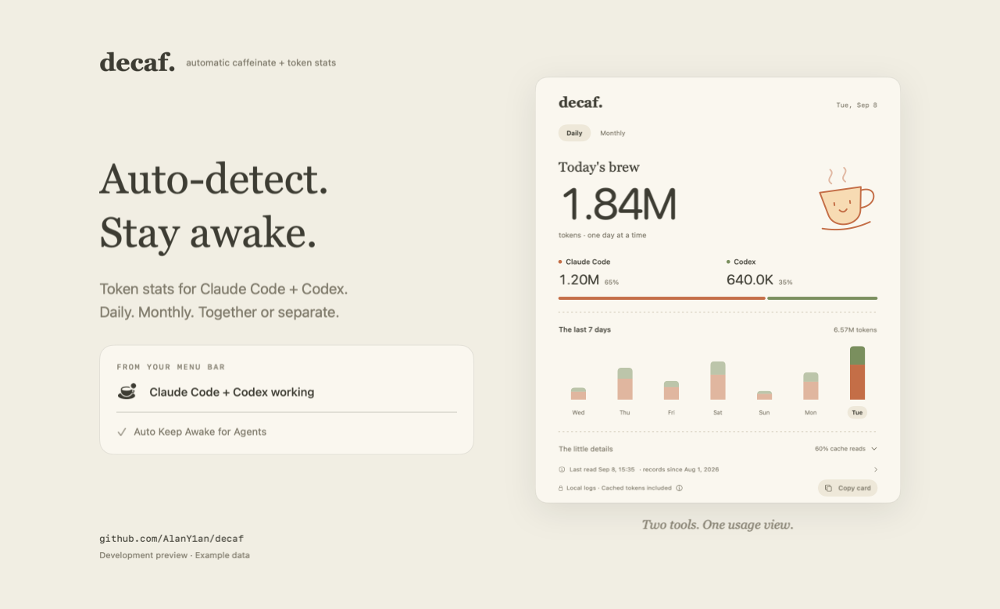
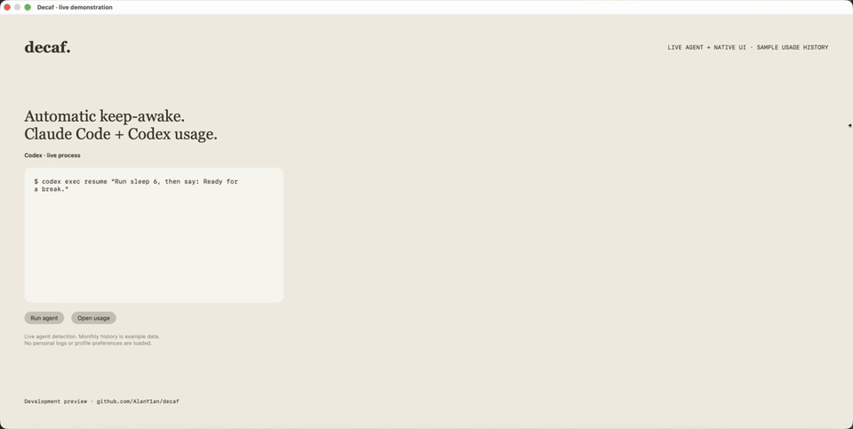

<div align="center">


# Decaf

**Keep your Mac awake while agents work. End the day with a little token receipt.**

A native macOS menu bar app: automatic agent detection and unified daily/monthly token usage for Claude Code + Codex.

[Get started](#get-started) · [Three uses](#three-uses) · [Guide](docs/usage.md) · [中文](README.zh-CN.md)

</div>

<picture>
  <source media="(prefers-color-scheme: dark)" srcset="docs/assets/readme-hero-dark.png">
  
</picture>

<sub>Native statistics view and menu status excerpt, composed with example data.</sub>

> **New in v0.2.0:** Codex support, daily/monthly statistics and Your brew. Already using Decaf? [Update in two steps →](docs/usage.md#update)

## Three uses

- **Automatic keep-awake.** Detect agent activity and keep the Mac awake, then release after the applicable grace or idle window. Each tool's hold is independent. Manual timers and battery protection are available too.
- **Unified token statistics.** Claude Code + Codex daily, calendar-month and historical usage, combined or per tool, with cache details and import status.
- **A personal record.** Your brew profiles and monthly cards, previewed, copied or saved on your Mac. Monthly cards hide token totals by default. [Full usage guide →](docs/usage.md)

<details>
<summary>16 seconds of real interaction: run an agent → monthly usage → save a card</summary>

<picture>
  <source media="(prefers-reduced-motion: reduce)" srcset="docs/assets/readme-hero-light.png">
  
</picture>

An actual Codex run, the native menu and monthly statistics, then a PNG saved through the real save dialog. Recorded in an isolated demo harness with example monthly history; pauses between actions are cut. Codex's file-activity grace may keep the Mac awake after a task ends. [Watch the MP4](docs/assets/decaf-live-demo.mp4).

</details>

## Get started

Requires **macOS 14 or later**.

1. **Install.**

   ```sh
   brew install --cask AlanY1an/decaf/decaf
   ```

   Or [download the DMG](https://github.com/AlanY1an/decaf/releases/latest).

2. **Find the cup.** Open Decaf from Applications and look in the menu bar. Claude Code hooks are optional; Settings previews the changes before installation.
3. **Start a task.** Check detection status in the cup menu. Open **Today: … tokens…** for both tools’ usage and switch between **Daily / Monthly**. [First-use guide →](docs/usage.md#first-use)

<details>
<summary>A little extra: Your brew profile and monthly cards</summary>

Open **Your brew…** from the cup menu. Pick a month, add an optional nickname and coffee stamp, then preview your card. Token totals are hidden by default.

<picture>
  <source media="(prefers-color-scheme: dark)" srcset="docs/assets/profile-previous-month-card-dark.png">
  
</picture>

<sub>Example nickname and data. <a href="docs/usage.md#your-brew">Explore the profile and card options →</a></sub>

</details>

## Your data stays here

Decaf parses existing local logs and makes no app network requests. Counts include cached tokens and cover available records on this Mac; missing history stays missing. These are recorded tokens, not an account bill or a productivity score. [Data sources and limits →](docs/usage.md#your-data)

Keep-awake respects safety pauses; closing the lid still allows sleep. Codex detection is approximate. [How detection works →](docs/usage.md#what-to-expect)

## Make it better with us

Try it during a normal workday: Claude Code, Codex, or both. Did the first import make sense? Did your Mac stay awake when it should? Would you open it tomorrow? [Leave a short report →](https://github.com/AlanY1an/decaf/issues/new?template=feedback.yml)

Code, docs and accessibility fixes are welcome. [Contributing](CONTRIBUTING.md) · [Report a bug](https://github.com/AlanY1an/decaf/issues/new/choose) · [Uninstall](docs/usage.md#uninstall) · [MIT](LICENSE)
