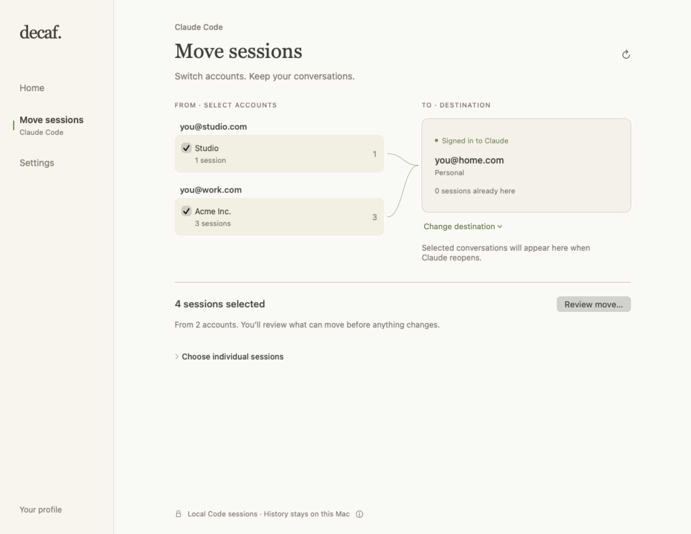

<div align="center">


# Decaf

**Agent 干活时，让 Mac 保持唤醒。**

自动防休眠，统一统计 **Claude Code + Codex** 的 token 用量。<br>
待在菜单栏里的一个小帮手。

**[下载 macOS 版](https://github.com/AlanY1an/decaf/releases/latest)** · [使用指南](docs/usage.zh-CN.md) · [English](README.md)

macOS 14+ · 免费开源 · 已签名与公证

</div>

```sh
brew install --cask AlanY1an/decaf/decaf
```

从「应用程序」打开 Decaf，在菜单栏找到杯子。

<picture>
  <source media="(prefers-color-scheme: dark)" srcset="docs/assets/readme-hero-dark.png">
  
</picture>

<sub>当前原生首页与菜单状态摘录，使用示例数据。</sub>

## 开始任务，然后去忙你的。

Decaf 检测到支持的 Claude Code 或 Codex 活动后，会自动阻止 Mac 因闲置休眠。
活动结束、对应缓冲时间过去后，再释放保活。两个工具同时运行时，一个结束不会
取消另一个的保活。

自动保活遵循安全设置，Codex 检测依赖本地活动线索。
屏幕可以熄灭，任务继续运行；合盖仍会允许系统休眠。
[检测方式与安全设置 →](docs/usage.zh-CN.md#功能与边界)

<picture>
  <source media="(prefers-reduced-motion: reduce)" srcset="docs/assets/home-light.png">
  
</picture>

<sub>真实 Codex 进程和 Decaf 0.3.3 原生界面，使用示例用量历史；剪掉了操作间的等待。[观看 MP4](docs/assets/decaf-live-demo.mp4)。</sub>

## 两个 Agent，一份用量视图。

查看 **Claude Code、Codex 或两者合计**的每日与每月 token，回看之前的月份，
展开缓存明细，检查本地记录的导入状态。

数字包含缓存 token，只覆盖这台 Mac 上可读取的记录，不代表订阅额度或账号账单。

月底还能留下一张自己的咖啡小票，记录这段时间的活动。默认隐藏 token 总量，
由你决定分享什么。[看看 Your brew →](docs/usage.zh-CN.md#your-brew)

<details>
<summary>一张可以分享的小票</summary>


</details>

## 换了 Claude 账号，还能接着聊。

切换 Claude Desktop 账号后，看不到之前的 Code 会话？**Move sessions** 可以把
符合条件的本地会话移到正在使用的账号。选择来源账号，确认已登录的目标，检查迁移内容，再回到
Claude 继续。原始条目会保留；记录和历史仍能验证时，可以撤销。

**仅限 Claude Desktop 中的本地 Claude Code 会话。** 先在 Claude 登录目标账号；
Decaf 会在迁移前核对本地记录。置顶和分组位置不会一起转移。
[支持范围与使用方法 →](docs/usage.zh-CN.md#迁移会话)

<picture>
  <source media="(prefers-color-scheme: dark)" srcset="docs/assets/sessions-selected-dark.png">
  
</picture>

<sub>原生界面，使用示例账号。</sub>

## 你的工作留在本机。

不用注册 Decaf 账号，不上传对话。检测、用量分析与会话迁移都在本地进行；主动
检查或下载更新时访问 GitHub。分享卡只导出到本机，由你决定是否转发。

[数据来源与边界](docs/usage.zh-CN.md#数据留在哪里) · [更新](docs/usage.zh-CN.md#更新) · [卸载](docs/usage.zh-CN.md#卸载) · [MIT](LICENSE)

## 一起把 Decaf 做得更顺手。

用 Claude Code 或 Codex 正常工作一天，告诉我们：**哪一点帮到了你，哪一点让你
不顺手？** 中英文都欢迎。

**[分享试用感受](https://github.com/AlanY1an/decaf/issues/new?template=feedback.yml)** · [报告问题](https://github.com/AlanY1an/decaf/issues/new/choose) · [适合入门的任务](https://github.com/AlanY1an/decaf/labels/good%20first%20issue) · [参与开发](CONTRIBUTING.md)

不写 Swift 也能参与：提供可复现的问题、改进文案，或帮忙检查无障碍体验。请使用
示例数据，不要上传原始对话或凭据。
