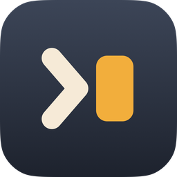
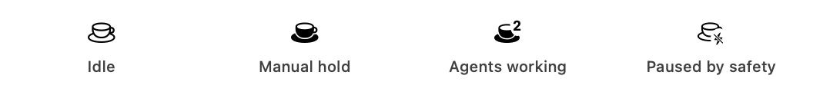
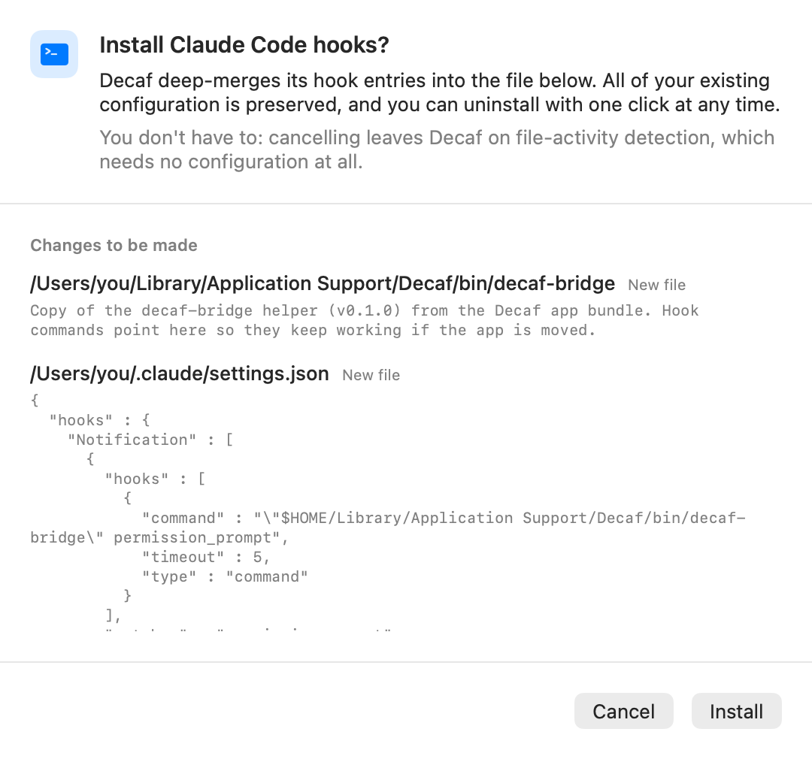

<div align="center">



# Decaf

**把 `caffeinate` 命令做成会自己判断的菜单栏应用。**

Claude Code 真正在干活的时候不让 Mac 休眠——活干完了,或者只是在等你回话,立刻放行。

<picture>
  <source media="(prefers-color-scheme: dark)" srcset="docs/assets/menubar-icons-dark.png">
  
</picture>

<sub>四种状态。第一种下 Mac 正常休眠。</sub>

<p>
  <a href="https://github.com/AlanY1an/decaf/releases/latest"></a>
  
  <a href="https://github.com/AlanY1an/homebrew-decaf"></a>
  <a href="LICENSE"></a>
  <a href="https://github.com/AlanY1an/decaf/actions/workflows/ci.yml"></a>
</p>

<a href="README.md">English</a>

</div>

---

## 它解决什么问题

你跑一个长任务,走开一会儿,回来发现它在第十分钟就停了——因为 Mac 睡了。

防休眠工具都是开关:开,或者关。开着不管,笔记本因为你开了个终端就整晚不睡。关着不管,你就得记得开。

那些「AI 感知」的进了一步,只要 agent 进程还在就保持。这确实更好,但在最要紧的那种情况下**依然是错的**:**一个停在提示符前等你的 agent,和一个正在埋头思考的 agent,长得一模一样。** 前者应该让 Mac 睡,后者绝不能。

把这两者分开,就是这个产品的全部。

## 它做什么

- **一个回合在进行中就保持。** 你提交提示 → 保持。回合结束 → 过一个宽限期后释放(默认 3 分钟)。
- **agent 在等你的时候放行。** 空闲的提示符不是干活。没被回答的权限弹窗也不是——不过它会先拿到五分钟窗口,所以你三秒后点了「允许」继续干活,不会白白唤醒一次。
- **长时间静默的工具调用也保持。** 一个跑 20 分钟的构建什么都不写,但它在干活。要四个独立证人都同意某个会话确实静默了,才会撤掉保持。
- **agent 自己声明的等待也保持。** 如果它安排了自己的唤醒——间隔 30 分钟的 `/loop`、一个 cron 任务——Decaf 会读到并保持到那个时刻。[为什么这条要紧 ↓](#declared-waits)
- **也可以手动保持。** 5/15/30 分钟,1/2/5 小时,「直到 18:00」,或者无限期。
- **该让路时让路。** 低电量模式、快速用户切换、电量门限都会释放全部保持。合盖或者你自己选「睡眠」永远优先——Decaf 只挡**空闲休眠**。

目前只支持 Claude Code。Codex 和 opencode 在路线图上。

## 安装

```sh
brew install --cask AlanY1an/decaf/decaf
```

或者从 [最新 release](https://github.com/AlanY1an/decaf/releases/latest) 下载 DMG。需要 **macOS 14 或更新版本**。

首次启动时 Decaf 会问你要不要把 hooks 装进 Claude Code。一次点击,可选,可撤销。

## 它怎么知道

| 层 | 精度 | 需要配置 |
| --- | --- | --- |
| **Hooks** | 精确到回合——回合开始、结束、向你提问的确切时刻。 | 一次点击,会往 `~/.claude/settings.json` 加条目。 |
| **文件活动** | 约 5 分钟。监视 `~/.claude` 下的写入。 | 无。这是默认状态。 |
| **CPU 采样** | 自己从不构成保持的理由;它是判定会话是否已经静默的证人之一。 | 无。 |

菜单里始终写着当前跑的是哪一层,**绝不宣称自己没有的精度**。安装 hooks 走的是深合并——你原有的 hooks 全部保留,卸载时也只移除 Decaf 自己加的那些。

<a name="declared-waits"></a>
## agent 声明的等待

自动循环是防休眠工具**要么证明自己有用、要么彻底没用**的场景。两次迭代之间,一个间隔 7 分钟的 `/loop` 看起来和空闲的 agent 完全一样——而如果 Mac 在这个间隙睡了,定时器就不会触发。循环会静默地卡住,直到你回来碰一下触控板。

这是实测出来的,不是推理:真实的一次运行,没装 hooks,每 20 秒采样一次 `pmset -g assertions`——保持在最后一次 transcript 写入的 300 秒后被释放,Mac 有 **1 分 40 秒**处于可休眠状态,直到下一次迭代把它唤醒。

而答案早就写在磁盘上了。在那次释放的**五分半钟之前**,agent 已经把 `ScheduleWakeup { delaySeconds: 420 }` 写进了自己的 transcript——它说了自己什么时候回来,而应用把这句话扔掉了。

现在 Decaf 会读它。四个调度工具被识别,声明的截止时刻会延长保持。三道护栏:**最多一小时**、**全部安全门限依然优先**、**解析不了的输入直接忽略**而不是拿去用。

## 隐私

Decaf 监视 `~/.claude`,这件事值得一个直接的回答。

- **不发任何网络请求。** 没有遥测、没有分析、没有更新检查——整个源码里没有 `URLSession`。
- **绝不读你的对话。** transcript 解析器只读一份固定的字段清单:标识符、时间戳、token 计数。`prompt`、`reason` 以及任何对话内容字段**从不读取、从不存储、从不记录**。每一处读取面都是一个闭合的 Swift enum 并有测试钉住,所以想扩大读取范围会**直接构建失败**,而不是指望代码评审发现。
- **日志结构上装不下内容。** 诊断信息是 `lineNotJSON` 这类枚举——一条日志在结构上就不可能携带 transcript 片段。
- **只写这些地方**:`~/Library/Application Support/Decaf/`,以及你装了 hooks 之后 `~/.claude/settings.json` 里它自己那几条。两者都能在设置里撤销。

而且这一切**在发生之前**就完整展示给你看,弹窗上那份文件清单是由真正执行写入的同一段代码生成的,不是手写的文案:

<picture>
  <source media="(prefers-color-scheme: dark)" srcset="docs/assets/consent-sheet-dark.png">
  
</picture>

完整字段清单见 [`docs/architecture.md`](docs/architecture.md)(英文)。

## 设置

六项,不多不少。

| | |
| --- | --- |
| **为 agent 自动保持唤醒** | 默认开。关掉后 Decaf 完全不管 agent。 |
| **释放宽限期** | 回合结束后再保持多久。1–10 分钟,默认 3。 |
| **保持唤醒时的屏幕** | 屏幕正常休眠(默认)或保持常亮。另有**立即关闭屏幕**操作。 |
| **电量门限** | 低于此电量停止保持。关 / 10% / 20% / 30%,默认 20%。 |
| **默认手动时长** 和 **「直到」时刻** | 一键手动保持的行为。 |
| **登录时启动** | |

## 卸载

```sh
brew uninstall --cask AlanY1an/decaf/decaf
```

如果装过 hooks,**先**用 设置 → Agents → **卸载 Hooks**——它只移除 Decaf 的条目,其余原样不动。如果应用已经删了,手动删掉 `~/Library/Application Support/Decaf/`,并移除 `~/.claude/settings.json` 里命令路径含 `Application Support/Decaf` 的条目。

电源断言随进程消亡,所以**退出或删除 Decaf 绝不可能让你的 Mac 从此无法休眠**。

## 路线图

- [x] Claude Code —— hooks、文件活动兜底、声明的等待
- [x] 手动保持、屏幕策略、电量门限
- [x] Token 用量与速率限制显示,每个数字都标注「官方」还是「估算」
- [ ] Codex —— 原生 hooks,低版本走 `notify` 兜底
- [ ] opencode —— 插件
- [ ] 定时时间窗
- [ ] 自动更新
- [ ] 合盖模式,需要特权 helper,并且会有醒目警告

## 常见问题

**既然干的是 `caffeinate` 的活,为什么叫 Decaf(低因)?**
因为这活的关键是**知道什么时候停**。这个品类里每个应用都以兴奋剂命名——Caffeine、Amphetamine、Theine、keepresso——而每一个都是你必须记得关掉的开关。Decaf 是那个会自己放下的。副标题仍然写 `caffeinate`,因为那是你熟悉的命令;但应用本身刻意不叫这个名字,这样它永远不可能遮蔽 `/usr/bin/caffeinate`。

**和 KeepingYouAwake、Amphetamine 有什么区别?**
那些是开关,而且是好开关。Decaf 是**做判断**的。如果你要的就是一个开关,KeepingYouAwake 维护得很好,你应该用它。(需要的时候 Decaf 也是那个开关——手动保持一样都不缺。)

**不装 hooks 能用吗?**
能,而且这是默认状态。代价是失去回合级精度——分辨率大约 5 分钟而不是即时——菜单里会明说。

**为什么不上 Mac App Store?**
沙盒禁止检查其他进程,也禁止 hook 桥接所需的「socket + helper」结构。这是**永久决定**,不是待办事项。

**会耗电吗?**
它只能**阻止休眠**,而且低于 20% 就停手。默认模式下,agent 不干活时 Mac 就正常休眠——对多数人来说,这比一个忘了关的开关**更省电**。

## 从源码构建

```sh
git clone https://github.com/AlanY1an/decaf.git
cd decaf
Scripts/bootstrap.sh
swift test --package-path Core
```

逻辑都在 `Core/`,是一个不依赖 AppKit 的纯 Swift 包——这正是它能被测试的原因:**642 个测试**覆盖电源引擎、会话状态机、transcript 解析器和安装器,应用层另有 105 个。`Decaf.xcodeproj` 由 `project.yml` 生成且不提交,要改改清单文件。

架构说明见 [`docs/architecture.md`](docs/architecture.md)(英文)。

## 许可证

MIT,见 [LICENSE](LICENSE)。
