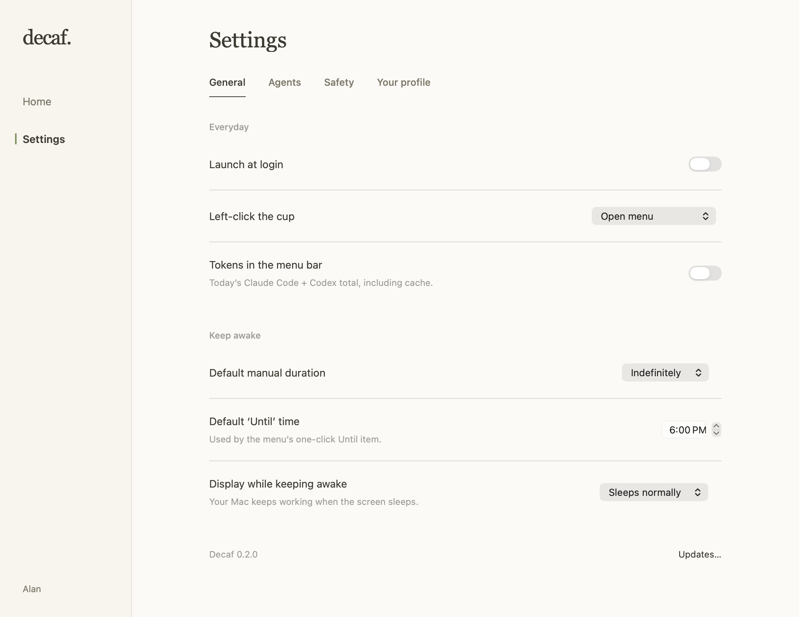

# Home and Settings

Available in Decaf 0.3.0. Home brings automatic keep-awake, both agents’ token
usage and Your brew together, with Settings alongside it.

Open **Open Decaf…** from the cup menu (⇧⌘P), or reopen a running Decaf from Finder
or Spotlight. The existing usage shortcut (⇧⌘U) opens the same Home window.
**Settings…** and ⌘, select Settings in that window. Closing it leaves the menu-bar
app and agent detection running.

Home displays the engine's status, including manual holds and safety pauses.
**Pause auto** affects automatic agent holds only; it does not stop a manual hold.
The automatic switch applies to both Claude Code and Codex, as in the released
app. The status links directly to Settings → Agents.

Daily and Monthly use the existing local usage ledger and cached-token accounting.
Select an agent to filter the token panel, use month arrows to revisit history,
and select a chart bar for a day. The Your rhythm grid remains a combined view of
both agents for the selected month. Blank dates mean no recorded usage, not proof
that no work happened. Importing and incomplete-history states remain explicit.

**Share your brew** previews the selected month's card before copying or saving.
Nickname, avatar and the default inclusion of token totals are in **Settings →
Your profile**. Existing preferences, integration controls, safety gates, update
instructions and consent sheets retain their underlying implementations.

Navigation uses short fades and a moving selection indicator. Numbers and charts
animate between selections; cells respond to hover. System Reduce Motion disables
movement. Home retains its filters and scroll position across settings visits.

<picture>
  <source media="(prefers-color-scheme: dark)" srcset="assets/settings-general-dark.png">
  
</picture>

<sub>Native settings, isolated example preferences.</sub>

## Local validation

```sh
xcodegen generate
swift test --package-path Core
xcodebuild -scheme Decaf -configuration Debug -derivedDataPath build/interface-dev CODE_SIGNING_ALLOWED=NO test
mkdir -p build/interface-qa
docs/assets/render/build.sh
docs/assets/render/.build/release/DecafRender --interface build/interface-qa
```

The renderer uses synthetic inputs and isolated preferences. It covers light/dark
Home, all four settings pages, a compact window and a loading/safety state. It
does not install integrations or create power assertions.
