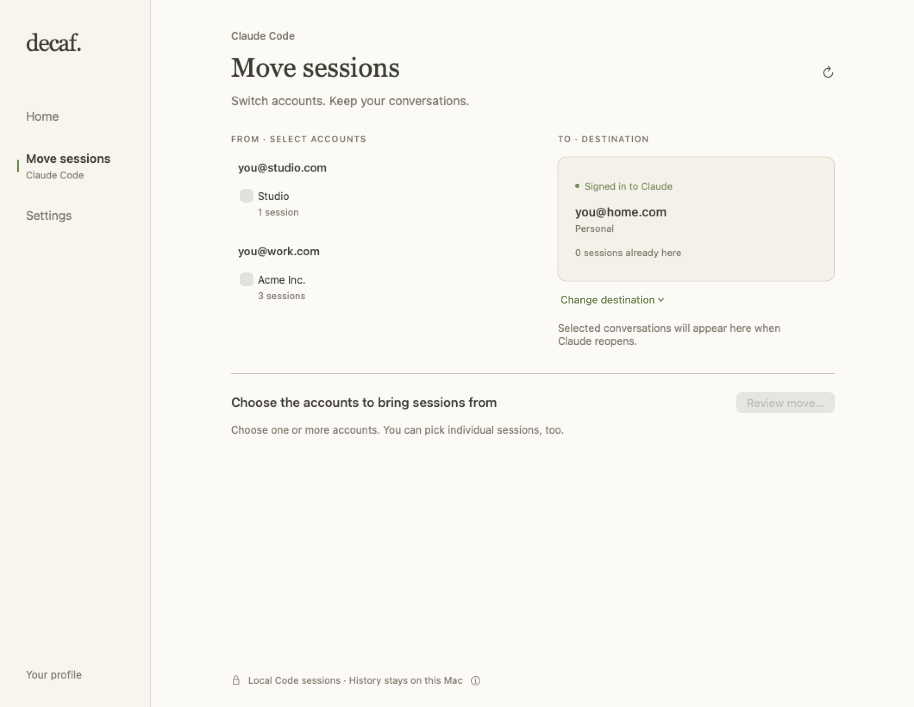
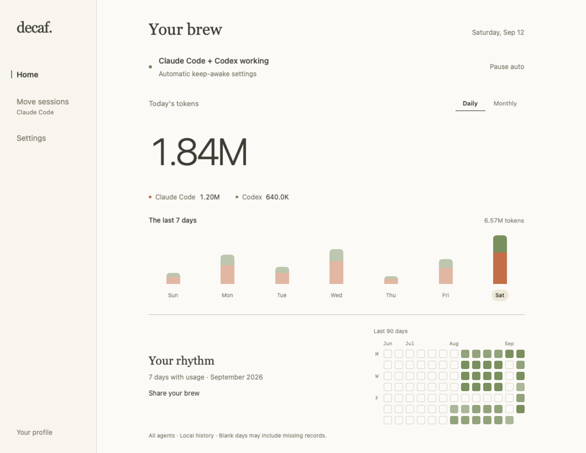
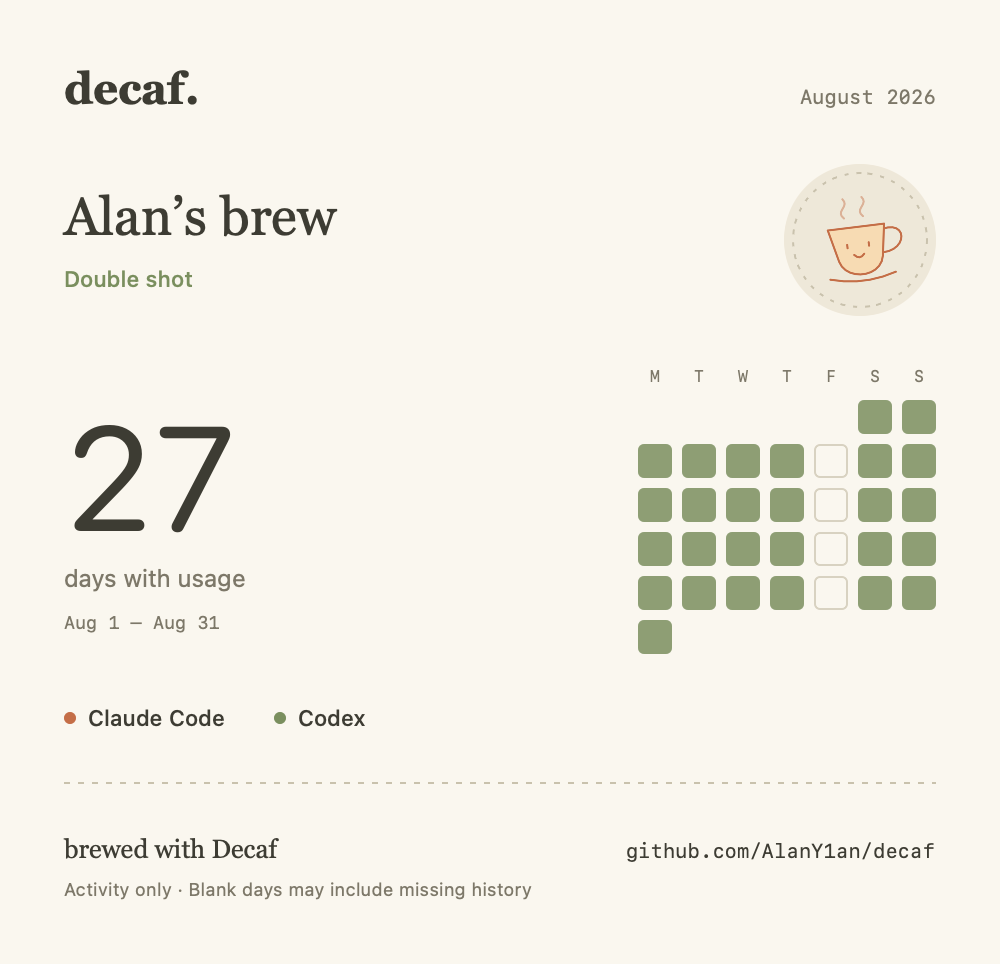
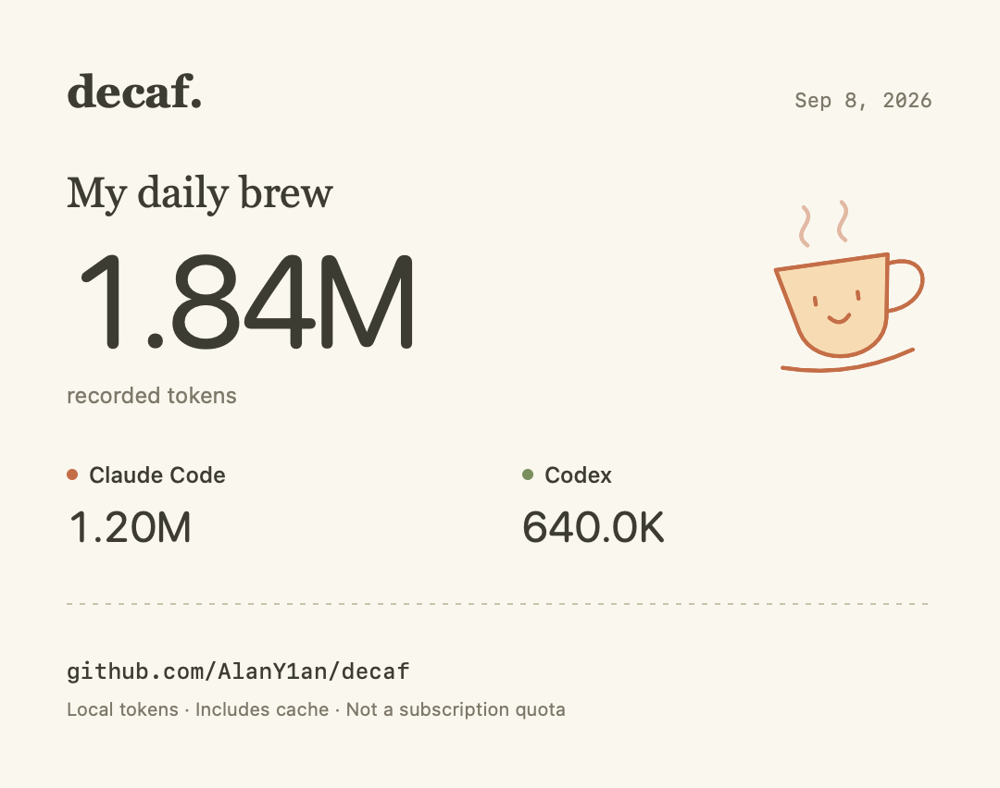

# Using Decaf

[← README](../README.md) · [中文](usage.zh-CN.md)

Home brings together automatic keep-awake, Claude Code/Codex usage and Your brew.
The sidebar also has **Move sessions · Claude Code** and **Settings**. [Window guide](interface.md).

[Install](#install) · [Update](#update) · [First use](#first-use) · [Behavior and limits](#what-to-expect) · [Privacy](#your-data) · [Uninstall](#uninstall)

## Install

Requires **macOS 14 or later**.

```sh
brew install --cask AlanY1an/decaf/decaf
```

Or download the DMG from [GitHub Releases](https://github.com/AlanY1an/decaf/releases/latest).

Open **Decaf** from Applications, then look for the coffee cup in your menu bar. There is no Dock icon. Claude Code hooks are optional: the app shows exactly what they change before you install them.

## Update

**0.3.1 and later:** choose **Check for Updates…** in the cup menu or **Settings →
General**, then install and relaunch from the update window. Opening settings does
not start a request. Updates preserve preferences and usage history. 0.3.0 and
earlier need the manual update below once to obtain this updater. Homebrew users
can continue using Homebrew; **Update options…** keeps those instructions available.
[Updater details](updating.md).

First quit Decaf from the cup menu. Then use the same method you installed with:

- **Homebrew:** run the commands below, then open Decaf from Applications.
- **DMG:** [download the latest release](https://github.com/AlanY1an/decaf/releases/latest),
  open it, replace Decaf in Applications, then reopen the app.

```sh
brew update
brew upgrade --cask AlanY1an/decaf/decaf
```

**Upgrading from 0.2.0 or earlier:** 0.3.0 includes the Codex recovery fix from 0.2.1; after reopening, wait for the import to
finish, then open **Home → Monthly**, select **Codex** and browse the
affected months. Decaf automatically backs up the old Codex cache and re-reads
available active and archived logs, restoring usage previously skipped when
parent/child counters were mixed or completed responses were not counted.
Corrected totals can increase or decrease after deduplication. Recovery requires
the original logs on this Mac; deleted or remote-only logs cannot be reconstructed.
Do not delete the cache or reinstall to trigger recovery.

No uninstall is needed. Your preferences and integration paths stay in place,
including the existing left-click behavior. When upgrading from 0.1.0, the first
launch backs up the old usage stores before rebuilding statistics from available
logs. Wait for the import status to finish; corrected counts may differ from the
old version. Missing source logs cannot be recovered; previous stores remain in
`~/Library/Application Support/Decaf/Backups/`. Avoid `brew uninstall --zap` or
deleting Application Support when updating.

In v0.2.0–0.3.0, **Updates…** in the cup menu or **Settings → General** shows
these instructions and the installed version. It opens the release page only
when clicked; there are no background checks or automatic installs. Version
0.1.0 has no in-app update channel. To hear about future releases, select
**Watch → Custom → Releases** on [GitHub](https://github.com/AlanY1an/decaf).

See the [changelog](../CHANGELOG.md) for what changed. Homebrew's
[update and upgrade commands](https://docs.brew.sh/Manpage) and GitHub's
[release notifications](https://docs.github.com/en/subscriptions-and-notifications/get-started/configuring-notifications)
are documented by their respective projects.

## Build from source

With Xcode installed:

```sh
git clone https://github.com/AlanY1an/decaf.git
cd decaf
Scripts/bootstrap.sh
Scripts/run.sh
```

This builds and opens the checkout locally. See [Contributing](../CONTRIBUTING.md) for tests and development details.

## First use

1. Run a task in Claude Code, Codex, or both on this Mac.
2. Open the coffee cup menu → **Open Decaf…** to see Home: keep-awake status, daily usage and Your rhythm. **Pause auto** pauses automatic holds for both agents; manual holds remain controlled from the cup menu. New installs open the menu on click; existing installs keep the left-click toggle (right-click opens the menu). Choose either behavior in **Settings → General → Left-click the cup**.
3. Switch to **Monthly** for this month so far; use the arrows to browse months with retained history. Pick a bar to inspect a day, or click the month total to return. Click an agent's name to filter. The month receipt shows days with recorded usage and the average across those days; a day shared by both agents counts once.
4. Click the read-status line to see each tool’s local log count, last read time, earliest usage and any import issues. No-log and importing states are distinct from a quiet day. The earliest date does not guarantee complete history. **Copy support summary** copies versions and import status for a bug report, without usage totals or log contents.
5. **The little details** shows the cache-read share and expands input, output and cache counts. The percentage is cache reads divided by all recorded tokens. **Copy card** puts a PNG of the selected day or month and agents on your clipboard. Paste it wherever you choose; Decaf never uploads it.

## Move sessions

**Move sessions · Claude Code** in the sidebar moves local Code conversations
between accounts in **Claude Desktop 1.52386.3**. It is useful after signing into
a different account and finding that earlier conversations no longer appear.
Other Desktop versions are listed for inspection but cannot move sessions until
their format is verified. Codex, web chats and remote/scheduled sessions are not
supported by this feature.

1. Sign in to the destination account in Claude Desktop. Open **Move sessions**
   in Decaf, or **Move Claude Code sessions…** in the cup menu.
2. Select one or more source accounts and one destination. Nothing is selected
   as a source automatically. Email and organization names come from matching
   local account records. **Add email** supplies a missing display label; it
   does not establish identity or sign in. Expand conversations to exclude
   individual sessions and see available pin/group labels.
3. Choose **Review move…** and inspect the ready count and any held entries.
   Confirm to let Decaf quit Claude normally, move eligible entries, verify the
   result and reopen Claude. If Claude or a session worker remains active, the
   affected move is refused.

Conversation IDs and transcript files stay in place. Original account entries
and a durable operation record are saved under
`~/Library/Application Support/Decaf/SessionMoves/`. Pins, group placement,
Remote Control bridge references and per-session permission grants are not
carried into the destination. Reapply organization and permissions in Claude.

**You can move the same conversation between accounts again later**, including
A → B → A. Sign in to the next destination and start a new move. Conversation
history stays in the same file, including messages added between moves.

**Undo last** rolls back the last operation only while its entries and history
remain unchanged. Moving back after continuing a conversation is a new move.
If a stopped Undo leaves a review open, **Keep here & continue** closes that
review after Decaf verifies the current placement, history and saved originals.
This also works for older receipts when Claude has rewritten a valid listing.
It ends Undo for that operation; you can still move those conversations again.
Missing history or ambiguous placement must be inspected first. **Show saved
records…** opens the retained local records; keeping a move does not delete backups.

<picture>
  <source media="(prefers-color-scheme: dark)" srcset="assets/sessions-dark.png">
  
</picture>

<sub>Native interface with example accounts; opening this page does not move sessions.</sub>

## Your brew

Your brew now lives on **Home**, opened from **Open Decaf…** in the cup menu
(**⇧⌘P**) or by reopening Decaf from Finder or Spotlight. Closing the window leaves
menu-bar detection running. **Settings…** or **⌘,** opens Settings in that same window.

**Your rhythm** shows 90 days of recorded activity across both tools. Select
**Monthly** and use the arrows to revisit history; the activity grid ends at the
selected month's last day. The token filter affects the token panel; the activity
grid remains a combined view. Blank dates may be missing history, and two agents
used on the same day count as one active day.

Choose **Share your brew** to preview the selected month's exact PNG before copying
or saving. Choose **System**, **Light** or **Dark** for the card. Token quantities and
intensity are hidden by default; turn on **Show token totals** to include them.
Change your optional nickname, coffee icon and sharing default in **Settings →
Your profile**. Returning from Settings retains Home's month, filter and scroll
position. System Reduce Motion is respected.

<picture>
  <source media="(prefers-color-scheme: dark)" srcset="assets/home-dark.png">
  
</picture>

<sub>Home in 0.3.0. Native interface, example data and nickname.</sub>

<picture>
  <source media="(prefers-color-scheme: dark)" srcset="assets/profile-previous-month-card-dark.png">
  
</picture>

<sub>A month to keep. Example data; generated locally, ready to copy or save.</sub>

**Menu bar options:** show today’s combined token count beside the cup, or keep the icon alone. **⇧⌘U** opens statistics while the menu is active. The first-run guide checks both tools and links directly to your usage.

<picture>
  <source media="(prefers-color-scheme: dark)" srcset="assets/usage-card-dark.png">
  
</picture>

<sub>The copied receipt. Example data; no project names, paths, prompts or account details.</sub>

## What to expect

| | v0.1.0 | v0.3.0 |
| --- | --- | --- |
| Claude Code keep-awake | Optional hooks, file-activity fallback | Same |
| Codex keep-awake | — | Task logs + process check, with file-activity fallback |
| Daily + monthly Claude Code / Codex statistics | — | Combined or per-agent totals, daily trends, previous months |
| Home + Settings | — | Keep-awake status, usage, activity and settings in one window |
| Your brew | — | Local nickname/icon, 90-day activity, monthly share cards |
| Copy a daily or monthly receipt | — | PNG, generated locally |
| Manual keep-awake, timers and battery protection | Yes | Yes |

Monthly totals cover retained local records, including cached tokens. Missing sessions are not included; this is not an account-wide usage report.

**Using both tools is supported.** Their usage is recorded separately and combined for the daily total. Their keep-awake requests are independent, so one ending does not cancel the other.

Claude Code hooks provide turn-level signals. For Codex, Decaf extends keep-awake across silent tasks when the local log records an unfinished turn and a Codex process still owns that log for writing. Completion, cancellation or a closed writer removes this extension; ordinary file activity still has a five-minute idle window. Two hours without task progress ends the extension. Approval waits are not reliably recorded, so detection remains approximate. Manual keep-awake remains available.

Low Power Mode, a low battery and other safety conditions can pause keep-awake. Closing the lid still allows the Mac to sleep.

## Your data

- **Detection and usage accounting stay local.** Starting with 0.3.1, an explicit update check or download connects to GitHub and its download CDN. No background checks, analytics, system profiling or conversation uploads. Clicking release links opens your browser.
- Existing local logs are parsed for detection and usage metadata. Conversation bodies are not retained or uploaded.
- Decaf reads Claude Code logs (including subagents) and Codex live/archived session logs (`~/.codex/sessions` and `archived_sessions`, or under `CODEX_HOME`).
- Accounting upgrades back up the previous usage stores before rebuilding available history. Ambiguous counter changes are marked for review.
- Counts include cached tokens and cover available logs on this Mac. They are not account-wide totals, subscription quotas, money spent or a measure of productivity.
- Daily/monthly receipts export the selected date and agent token totals. Profile cards export your chosen nickname/icon, the selected month’s recorded activity and tools; token totals are optional and off by default. Both include the Decaf repository address. You choose whether to share them.
- Profile preferences stay in local app preferences; the share card uses your chosen nickname, not discovered account identities. Clear the nickname in Settings → Your profile to return to the generic card.
- Move sessions reads local Claude account/profile and session metadata to match emails and organizations to exact account IDs. Labels stay in local preferences. Confirmed moves save original session-entry metadata and operation records locally; transcripts are validated in place, not uploaded or rewritten.
- Optional Claude hooks and statusline integration change only Decaf's entries, with a preview and uninstall controls in Settings.

More detail: [Architecture and data flow](architecture.md).

## Uninstall

If you enabled integrations, remove them first in **Settings → Agents** using **Uninstall Hooks** and the statusline uninstall control. Then quit Decaf and run:

```sh
brew uninstall --cask AlanY1an/decaf/decaf
```

For a DMG install, move Decaf out of Applications. Quitting releases its power assertions.
